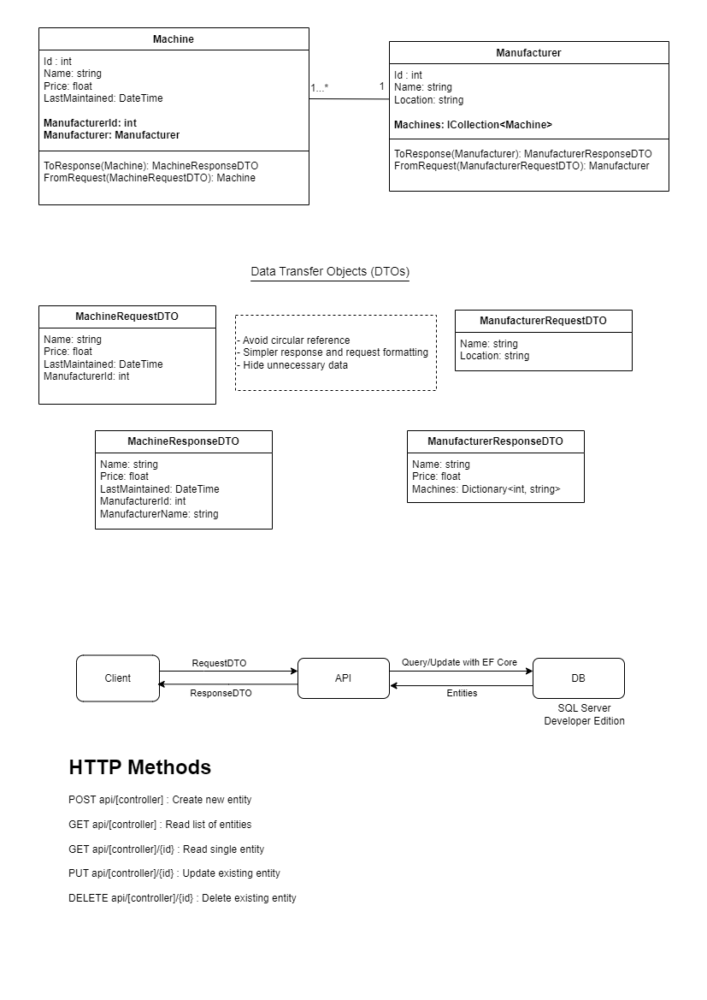

# Machine Inventory Web API

A backend API for managing machine maintenance in a company.

## Requirements

- ASP.NET 6.0
- EF Core

## Usage - Development

Set up Microsoft SQL Server (Standalone, Docker or remote) and run database migration.

```
dotnet ef database update
```

Edit the connection string on appsettings.json.

Run the API on your IDE or on the .NET CLI watch tool for hot reload feature.

```
dotnet watch
```

## Documentation

